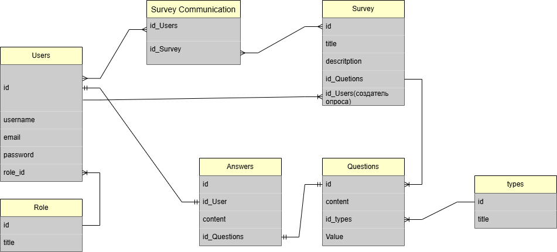

# Feedback
Django-приложение для создания и прохождения опросов.

## Особенности

- **Авторизация:**  
  Возможность входа в личный кабинет, сохранение токенов пользователей для удобной работы.

- **Опросы:**  
  Создавать опросы с различными типами вопросов, отправление опросов пользователям, сохранение ответов и просмотр ответов отправителем.

## Структура базы данных

Вот схема БД (ER-диаграмма):



## Установка

1. **Клонируйте репозиторий:**
   ```bash
   git clone https://github.com/deotef/test_repo1
   ```

2. **Перейдите в директорию проекта:**
    ```bash
    cd feedback_django
    ```

3. **Выберите версию из dev ветки для самого последнего функционала:**
    ```bash
    git checkout dev
    ```

4. **Установите зависимости:**
    ```bash
    python -m venv .venv

    .venv\Scripts\activate

    pip install -r requirements.txt
    ```

5. **Примените миграции:**
    ```bash
    python manage.py migrate 
    ```

6. **Запустите сервер:**
    ```bash
    python manage.py runserver
    ```

**by Sergey**